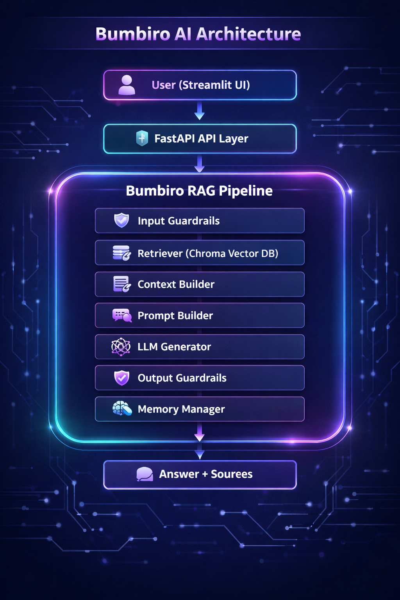
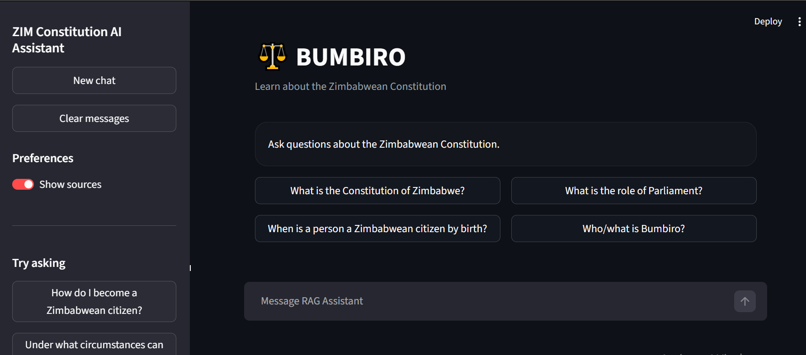
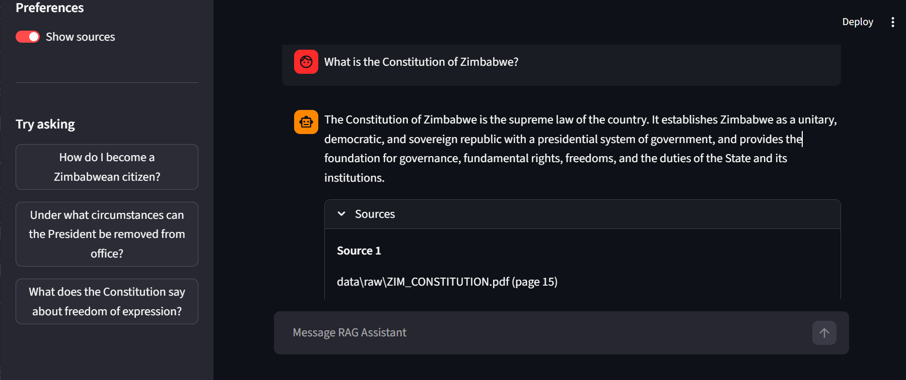
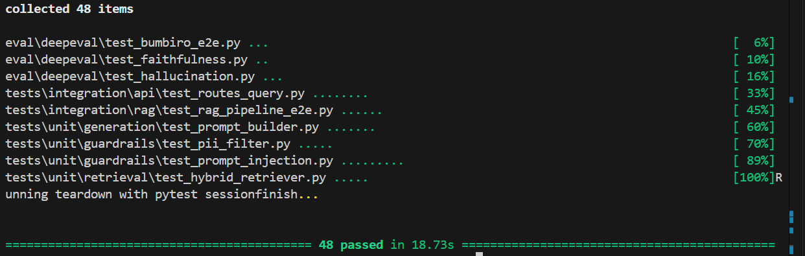
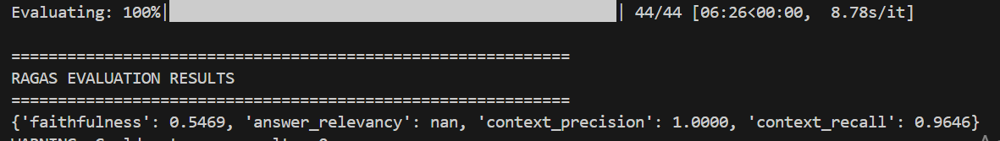
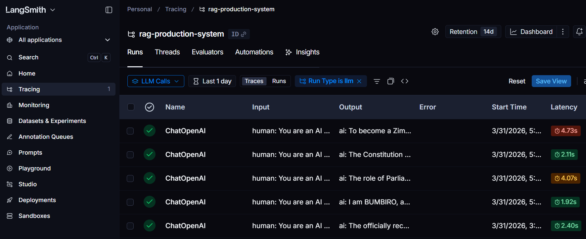

# ⚖️ Bumbiro — AI Constitutional Assistant

> Grounded constitutional question answering for the Zimbabwe Constitution through retrieval-augmented generation, guardrails, evaluation, and a production-style backend.


---

## Table of Contents

* [Bumbiro Demo Video](#bumbiro-demo-video)
* [Overview](#overview)
* [Why Bumbiro Exists](#why-bumbiro-exists)
* [What This System Does](#what-this-system-does)
* [Engineering Highlights](#engineering-highlights)
* [System Architecture](#system-architecture)
* [RAG Pipeline Flow](#rag-pipeline-flow)
* [Screenshots](#screenshots)
* [Testing and Evaluation](#testing-and-evaluation)
* [Observability](#observability)
* [API Endpoints](#api-endpoints)
* [Project Structure](#project-structure)
* [Getting Started](#getting-started)
* [Example Questions](#example-questions)
* [Why This Project Stands Out](#why-this-project-stands-out)
* [Future Improvements](#future-improvements)
* [Author](#author)

---
## Bumbiro Demo Video

A short walkthrough of Bumbiro AI showing retrieval-augmented constitutional question answering, grounded responses, and source-backed output. 
https://youtu.be/ZFCZWftT4Qk

[](https://youtu.be/ZFCZWftT4Qk)
---

## Overview

**Bumbiro** is an AI-powered constitutional assistant built to answer questions about the **Zimbabwe Constitution** using a retrieval-augmented generation (RAG) architecture.

Rather than acting like a generic chatbot, Bumbiro is engineered to retrieve relevant constitutional text, assemble grounded context, generate a response, and return the supporting sources used to produce that answer.

The project is designed around a simple but important idea: for legal and civic information, **trust matters as much as usability**. That means the system must do more than generate fluent text. It must be structured, source-aware, testable, and explainable.

Bumbiro reflects that engineering approach by combining:

* a **Streamlit** user interface for natural-language interaction
* a **FastAPI** backend for clean API orchestration
* a modular **RAG pipeline** for grounded reasoning
* **guardrails** for safer, more reliable outputs
* **memory** for conversational continuity
* **Pytest**, **RAGAS**, and **DeepEval** for quality validation

---

## Why Bumbiro Exists

The Constitution is the supreme law of Zimbabwe, but for many people it remains difficult to access, navigate, and interpret efficiently.

Bumbiro was built to close that gap.

Its purpose is to make constitutional information:

* easier to access
* easier to understand
* easier to query in plain language
* more transparent through source-backed answers

This makes Bumbiro more than a simple LLM demo. It is a domain-specific AI system aimed at improving how users engage with civic and legal knowledge.

---

## What This System Does

Bumbiro allows users to ask constitutional questions such as:

* *What is the Constitution of Zimbabwe?*
* *What is the role of Parliament?*
* *When is a person a Zimbabwean citizen by birth?*
* *Under what circumstances can the President be removed from office?*
* *What does the Constitution say about freedom of expression?*

For each question, the system:

1. validates the query
2. retrieves relevant constitutional passages
3. assembles grounded context
4. builds a structured prompt
5. generates a response using the LLM
6. applies output checks
7. returns the final answer with sources

This architecture helps reduce hallucinations and improves answer traceability.

---

## Engineering Highlights

### Grounded Legal Retrieval

Bumbiro retrieves constitutional passages from a vector database instead of relying only on the model’s internal memory.

### Source-Backed Responses

The system returns **answer + sources**, improving transparency and user trust.

### Modular Backend Design

The UI, API layer, retrieval logic, generation logic, memory, and guardrails are separated into maintainable components.

### Reliability-Oriented Pipeline

The architecture includes validation before generation and checks after generation rather than treating LLM output as automatically trustworthy.

### Evaluation Beyond “It Works”

Bumbiro includes both software tests and LLM evaluation workflows, which is a stronger engineering signal than a UI-only demo.

---

## System Architecture

Bumbiro AI is designed as a retrieval-augmented generation system focused on answering questions about the Zimbabwe Constitution in a grounded, explainable, and user-friendly way. The architecture separates the user interface, backend API, and core reasoning pipeline so that each layer has a clear responsibility and can be maintained independently.

At the top of the flow is the **Streamlit UI**, which serves as the user-facing interface. This is where the user submits a constitutional question and views the final response. The UI is intentionally lightweight and focused on usability, leaving all processing logic to the backend services.

The request is then passed to the **FastAPI API Layer**, which acts as the entry point into the backend. This layer handles request routing, coordinates communication with the RAG service, and returns structured responses back to the interface. By using FastAPI, the system remains modular, testable, and production-friendly.

The core intelligence of the application lives inside the **Bumbiro RAG Pipeline**. This pipeline is responsible for validating the query, retrieving relevant legal context, building a grounded prompt, generating a response, and enforcing response quality before anything is shown to the user.

The first stage in the pipeline is **Input Guardrails**. These guardrails validate and sanitize incoming queries before they are processed further. Their role is to ensure that the system handles supported requests appropriately and prevents low-quality or unsafe inputs from moving deeper into the pipeline.

After validation, the request moves to the **Retriever**, which connects to the **Chroma Vector Database**. This component searches the embedded constitutional knowledge base and pulls back the most relevant document chunks for the user’s question. This retrieval step is what allows Bumbiro to answer based on source material rather than relying only on the model’s internal memory.

The retrieved content is then passed into the **Context Builder**. This stage organizes and refines the retrieved constitutional passages into a clean context package. Instead of passing raw search results directly to the model, the context builder helps ensure that only the most useful and relevant evidence is included.

Next, the **Prompt Builder** combines the user query, system instructions, and retrieved constitutional context into a structured prompt. This prompt is carefully assembled to guide the model toward producing an answer that is grounded in the source documents and aligned with the intended behavior of the application.

The structured prompt is then sent to the **LLM Generator**, which produces the natural-language answer. This is the reasoning and generation stage of the system, where the model synthesizes the retrieved evidence into a coherent response for the user.

Once the answer has been generated, it passes through **Output Guardrails**. These guardrails help verify that the final response is safe, relevant, and properly aligned with the supporting context. This extra validation layer improves reliability and reduces the chances of unsupported or poorly framed answers reaching the user.

Alongside the main retrieval and generation flow is the **Memory Manager**. This component helps the system maintain conversational continuity by keeping track of useful context across follow-up interactions. As a result, Bumbiro can support more natural multi-turn conversations instead of treating every question as completely isolated.

At the end of the pipeline, the system returns **Answer + Sources**. This final output is one of the most important parts of the architecture because it gives users not only a response, but also the supporting constitutional references used to produce it. That improves trust, transparency, and explainability.

Overall, this architecture ensures that Bumbiro is not just a chatbot, but a grounded constitutional assistant. By combining retrieval, prompt orchestration, guardrails, and memory, the system is able to produce responses that are more accurate, explainable, and reliable for legal and civic information use cases.

### Architecture Diagram



---

## RAG Pipeline Flow

```text
Zimbabwe Constitution Documents
        ↓
Document Loading and Cleaning
        ↓
Chunking
        ↓
Embeddings
        ↓
Chroma Vector Store
        ↓
User Query
        ↓
Retriever
        ↓
Context Builder
        ↓
Prompt Builder
        ↓
LLM Generator
        ↓
Output Guardrails
        ↓
Answer + Sources
```

This flow ensures that responses are grounded in retrieved constitutional evidence rather than unsupported general knowledge.

---

## Screenshots

### Streamlit Interface

The Streamlit interface provides a clean chat-style experience for constitutional question answering. It includes suggested prompts, conversational interaction, and a simple entry point for non-technical users.



### Answer with Sources

A core design goal of Bumbiro is explainability. The assistant returns both the generated answer and the supporting sources used to ground that answer.



### Testing Results

Bumbiro is validated like an engineered system, not just a front-end demo. The project includes tests across retrieval, generation, guardrails, and API behavior.



### Evaluation Results

The project also includes LLM evaluation workflows to measure answer quality, grounding, and retrieval performance.



---

## Testing and Evaluation

Bumbiro combines traditional software testing with LLM-specific evaluation to improve both engineering reliability and response quality.

### Test Strategy

The project includes:

* **unit tests** for isolated components
* **integration tests** for API and pipeline behavior
* **end-to-end validation** across core RAG flows

### Evaluation Tooling

Bumbiro uses:

* **Pytest**
* **RAGAS**
* **DeepEval**

### Evaluation Focus Areas

The evaluation pipeline focuses on:

* faithfulness
* answer relevance
* context precision
* context recall
* hallucination detection

This matters because an LLM system can appear fluent while still being wrong. Bumbiro is built to measure more than UI behavior.

---

## Observability

## 🔍 Observability with LangSmith

Bumbiro AI includes production-style observability powered by LangSmith for end-to-end tracing, debugging, and performance monitoring across the retrieval-augmented generation pipeline.

LangSmith traces capture:
- query lifecycle from Streamlit UI to FastAPI backend
- retriever calls against ChromaDB
- prompt construction and context assembly
- LLM response generation
- latency and failure points
- source grounding verification

This observability layer significantly improved debugging speed during retrieval failures, empty-context issues, and response quality tuning, making Bumbiro AI more reliable and production-ready.


---

## API Endpoints

### Query

```text
POST /query
```

Accepts a constitutional question and returns a structured response containing the answer and supporting sources.

### Streaming Query

```text
POST /query-stream
```

Supports streaming output for more interactive response delivery.

### Health Check

```text
GET /health
```

Used to verify backend availability and service health.

---

## Project Structure

```text
rag-production-system/
│
├── app/
│   ├── api/
│   │   ├── main.py
│   │   ├── dependencies.py
│   │   ├── routes.py
│   │   └── schemas.py
│   │
│   ├── core/
│   │   ├── config.py
│   │   ├── logging.py
│   │   └── vector_store.py
│   │
│   ├── ingestion/
│   │   ├── document_loader.py
│   │   ├── document_cleaner.py
│   │   ├── chunker.py
│   │   ├── embedder.py
│   │   ├── vector_store_manager.py
│   │   └── pipeline.py
│   │
│   ├── retrieval/
│   │   ├── base_retriever.py
│   │   ├── context_compressor.py
│   │   ├── retriever.py
│   │   ├── hybrid_retriever.py
│   │   ├── query_rewriter.py
│   │   └── reranker.py
│   │
│   ├── generation/
│   │   ├── base_generator.py
│   │   ├── prompt_builder.py
│   │   ├── source_formatter.py
│   │   └── generator.py
│   │
│   ├── memory/
│   │   ├── base_memory.py
│   │   ├── conversation_memory.py
│   │   ├── episodic_memory.py
│   │   ├── semantic_memory.py
│   │   └── memory_manager.py
│   │
│   ├── guardrails/
│   │   ├── guardrail_manager.py
│   │   ├── guardrails.py
│   │   ├── hallucination_check.py
│   │   ├── input_filter.py
│   │   ├── pii_filter.py
│   │   └── prompt_injection.py
│   │
│   └── rag/
│       ├── pipeline.py
│       └── service.py
│
├── assets/
│   ├── architecture/
│   │   └── system-architecture.png
│   ├── ui/
│   │   ├── streamlit-interface.png
│   │   └── answer-with-sources.png
│   └── tests/
│       ├── pytest-results.png
│       └── ragas-eval-results.png
│
├── data/
│   ├── raw/
│   └── embeddings/
│
├── eval/
│   ├── datasets/
│   ├── ragas_eval.py
│   └── deepeval_tests.py
│
├── tests/
│   ├── unit/
│   ├── integration/
│   ├── fixtures/
│   └── conftest.py
│
├── scripts/
│   ├── ingest_data.py
│   └── run_all_evals.py
│
├── .env
├── .env.example
├── requirements.txt
├── README.md
└── streamlit_app.py
```

---

## Getting Started

### 1. Clone the Repository

```bash
git clone https://github.com/SimbaMunatsi/rag-production-system.git
cd rag-production-system
```

### 2. Create and activate virtual environment

### windows
```bash
python -m venv .venv
```

```bash
.venv\Scripts\activate
```

### linux
```bash
python3 -m venv .venv
```

```bash
source .venv/bin/activate
```

### 3. Install Dependencies

```bash
pip install -r requirements.txt
```

### 4. Configure Environment Variables

Create a `.env` file in the project root:

```env
OPENAI_API_KEY=your_api_key
export LANGSMITH_API_KEY=your_langsmith_key
export LANGSMITH_TRACING=true
export LANGSMITH_PROJECT=rag-production-system
export LANGSMITH_ENDPOINT=your_langsmith_endpoint
CHROMA_DB_PATH=./data/embeddings
```

### 5. Ingest Constitutional Documents

```bash
python -m scripts.ingest_data
```

### 6. Start the FastAPI Backend

```bash
uvicorn app.api.main:app --reload
```

Swagger UI:

```text
http://localhost:8000/docs
```

### 7. Start the Streamlit Frontend

```bash
streamlit run streamlit_app.py
```

App UI:

```text
http://localhost:8501
```

---

## Example Questions

You can test Bumbiro with questions such as:

* When can the military be deployed?
* What does the constitution say about freedom of speech?
* Which languages are officially recognised in Zimbabwe?
* What political rights are guaranteed to Zimbabwean citizens?

---

## Why This Project Stands Out

Many LLM projects stop at a polished interface. Bumbiro goes further by demonstrating stronger systems thinking:

* **domain-specific retrieval** instead of generic chat behavior
* **source-grounded responses** instead of unsupported text generation
* **modular backend architecture** instead of tightly coupled app logic
* **guardrails and validation** instead of blind model trust
* **testing and evaluation workflows** instead of anecdotal demos
* **production-style separation of concerns** across UI, API, retrieval, generation, and memory

That makes Bumbiro a stronger portfolio project for AI engineering, backend engineering, and applied LLM system design.

---

## Future Improvements

* add a hosted demo walkthrough
* improve hybrid retrieval and reranking
* expand legal coverage beyond the Constitution
* add richer citation formatting and source display
* package deployment for cloud environments
* strengthen benchmark datasets and evaluation reporting

---

## Author

**Simbarashe Munatsi**

---

## Final Note

Bumbiro reflects a practical approach to building trustworthy AI systems for public-facing knowledge access.

It shows the shift from simply using an LLM to engineering a domain-specific system that emphasizes grounding, explainability, validation, and maintainability.
